# Fake Store — E-commerce

[](https://react.dev/)
[](https://tailwindcss.com/docs)
[](https://ui.shadcn.com/docs)
[](https://www.typescriptlang.org/docs/)

A responsive single-page e-commerce application built with React and TypeScript, powered by the [Fake Store API](https://fakestoreapi.com/docs).

## Features

- **Product catalog**: grid of products fetched from the API. Each card shows image, title and price.
- **Category filtering**: filter products by category from the header navigation. The selected category is reflected in the URL (`/category/:category`) and restored on a direct link or page refresh.
- **Product details**: dedicated product page displaying image, title, price, and description, accessible via its own URL (`/product/:productId`).
- **Authentication**: login/logout against the Fake Store API's `/auth/login` endpoint, with the session token persisted in `localStorage`.
- **Shopping cart**: authenticated users can add products to a cart, with a live counter and side-panel summary.
- **Wishlist**: authenticated users can save and remove favorite products, with its own side-panel summary.
- **Theme switching**: light and dark mode support.

## Screenshots

### Home

| Guest                          | Authenticated                 |
| ------------------------------ | ----------------------------- |
| 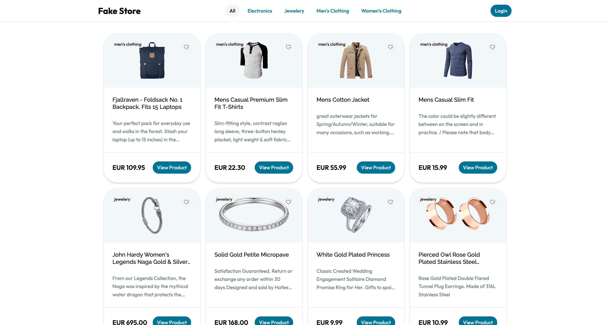 | 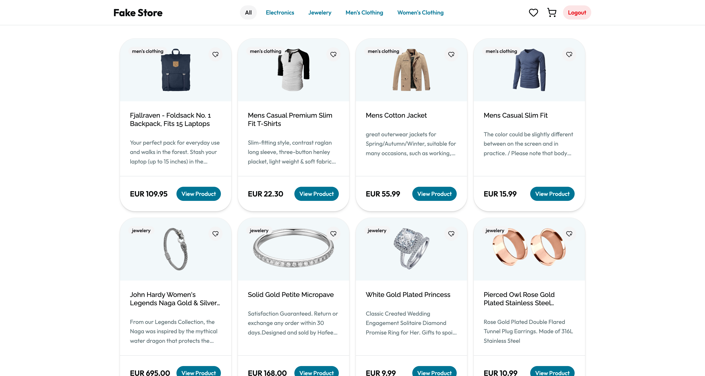 |
| 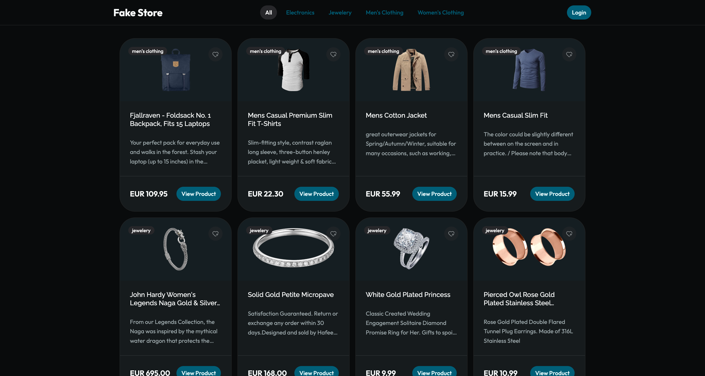  | 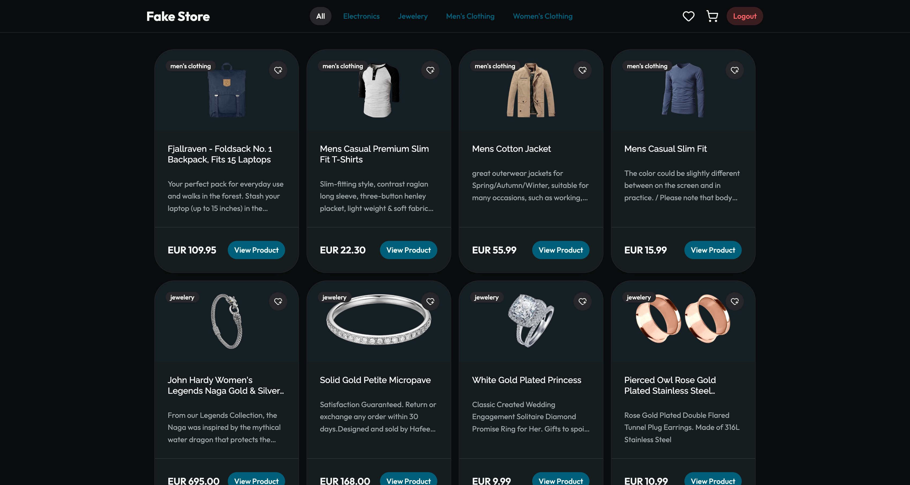  |

### Product Details

| Guest                             | Authenticated                    |
| --------------------------------- | -------------------------------- |
| 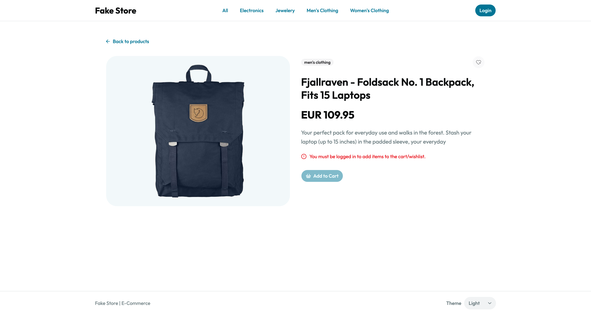 | 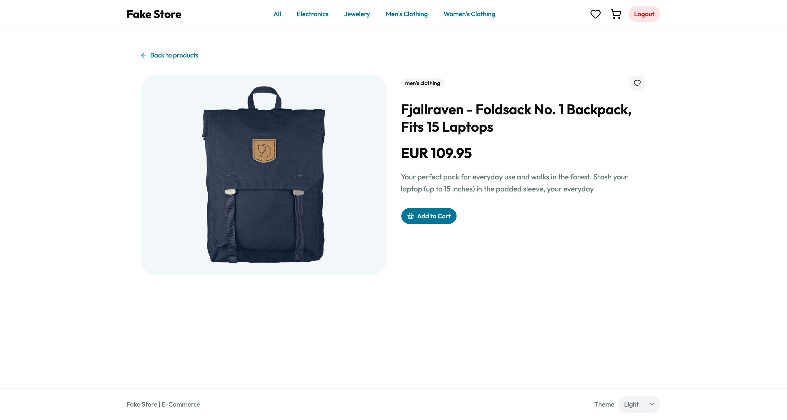 |
| 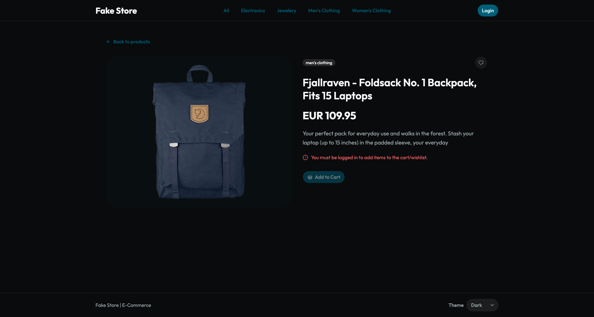  | 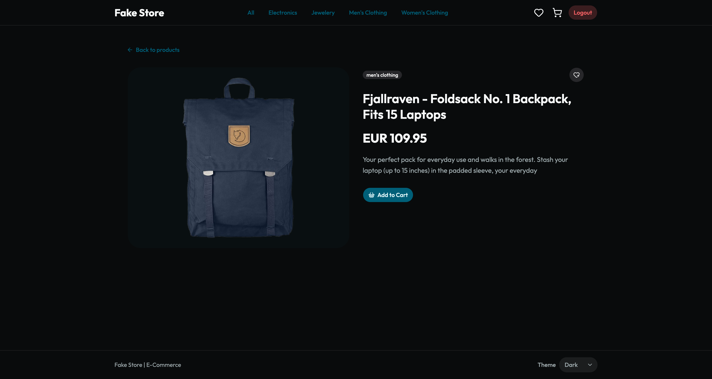  |

### Cart & Wishlist

| Cart                     | Wishlist                     |
| ------------------------ | ---------------------------- |
| 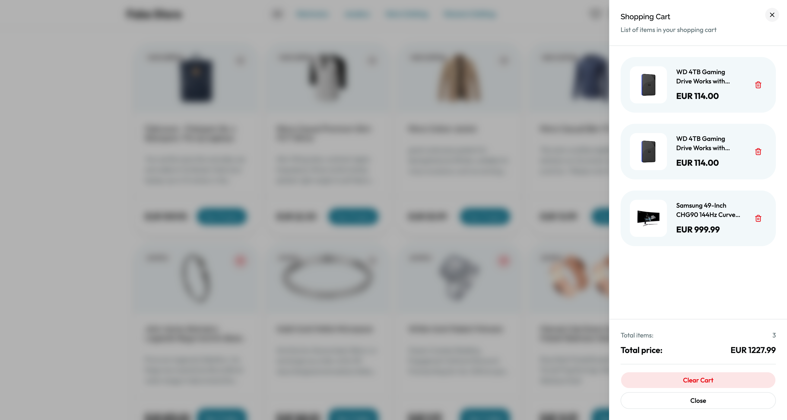 | 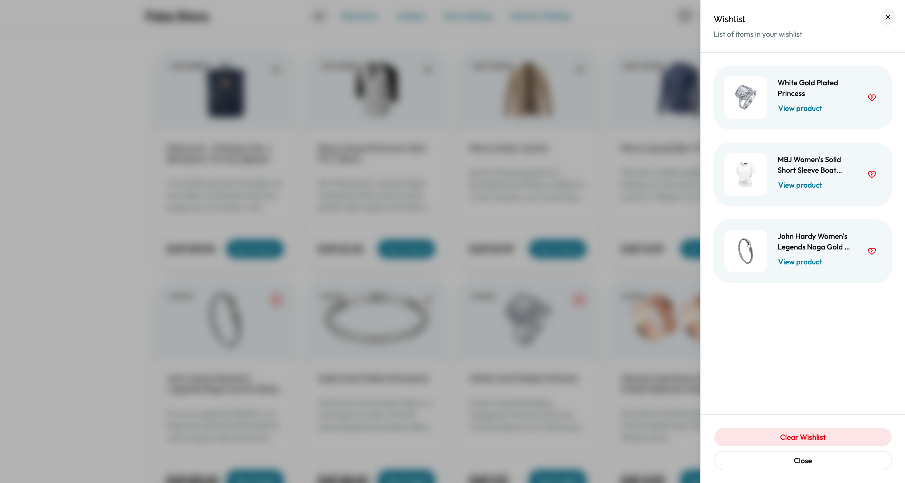 |
| 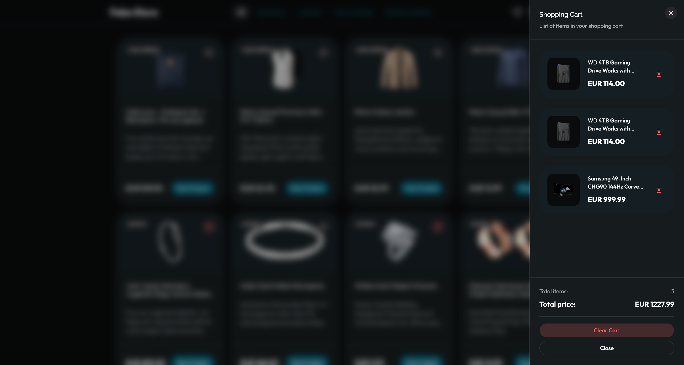  | 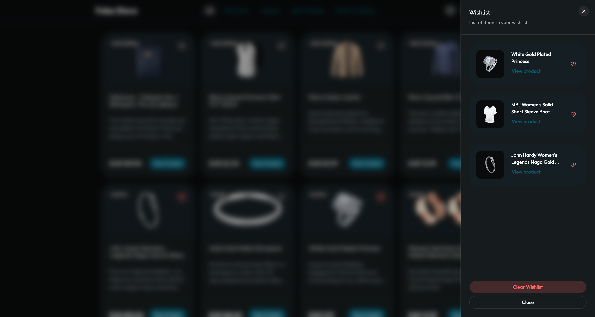  |

## Tech Stack

|            |                                                 |
| ---------- | ----------------------------------------------- |
| Framework  | React 19 + TypeScript                           |
| Build tool | Vite 8                                          |
| Routing    | React Router 7                                  |
| Styling    | Tailwind CSS 4 + shadcn/ui (Radix primitives)   |
| Testing    | Vitest + React Testing Library                  |
| API        | [Fake Store API](https://fakestoreapi.com/docs) |

## Getting Started

### Requirements

- Node.js 22
- npm

### Installation

```bash
git clone https://github.com/GentilOfficial/fake-store-ecommerce.git
cd fake-store-ecommerce
npm install
```

### Local Development

```bash
npm run dev
```

The app will be available at the local URL printed in the terminal (typically `http://localhost:5173`).

### Demo credentials

Cart and Wishlist features require authentication.

The Fake Store API provides public demo users. For example:

```
Username: johnd
Password: m38rmF$
```

Any user listed at [fakestoreapi.com/users](https://fakestoreapi.com/users) can be used with its corresponding credentials.

## Testing

Unit tests cover both logic and UI:

- **API layer**
  - `services/client.ts`
- **Custom Hooks**
  - `useProducts`
  - `useProductDetail`
  - `useCategories`
- **Context providers**
  - `AuthProvider`
  - `CartProvider`
  - `WishlistProvider`
- **Components**
  - `GlobalNetworkErrorProvider`
  - `ProtectedRoute`
  - `ProductPage`
  - `CartItem`
  - `CartSheet`

Run the test suite with:

```bash
npm test
```

Tests are also executed automatically on every push and pull request through GitHub Actions, which additionally verifies the production build.

## Project Structure

```
src/
├── components/    # Reusable UI components
├── constants/     # Application constants
├── context/       # React context definitions
├── hooks/         # Custom hooks
├── layouts/       # Shared layouts
├── lib/           # Utilities
├── pages/         # Route-level pages
├── providers/     # Context providers
├── services/      # Fake Store API client
├── test/          # Test configuration
└── types/         # Shared TypeScript types
```

## AI Usage

AI was used as a development support tool for:

- **Planning**: translating the requirements into an implementation roadmap.
- **Code review**: validating the implementation against the acceptance criteria and identifying issues.
- **Debugging**: assisting with development and testing issues.

## Author

**Federico Gentili**
GitHub: [@GentilOfficial](https://github.com/GentilOfficial)
